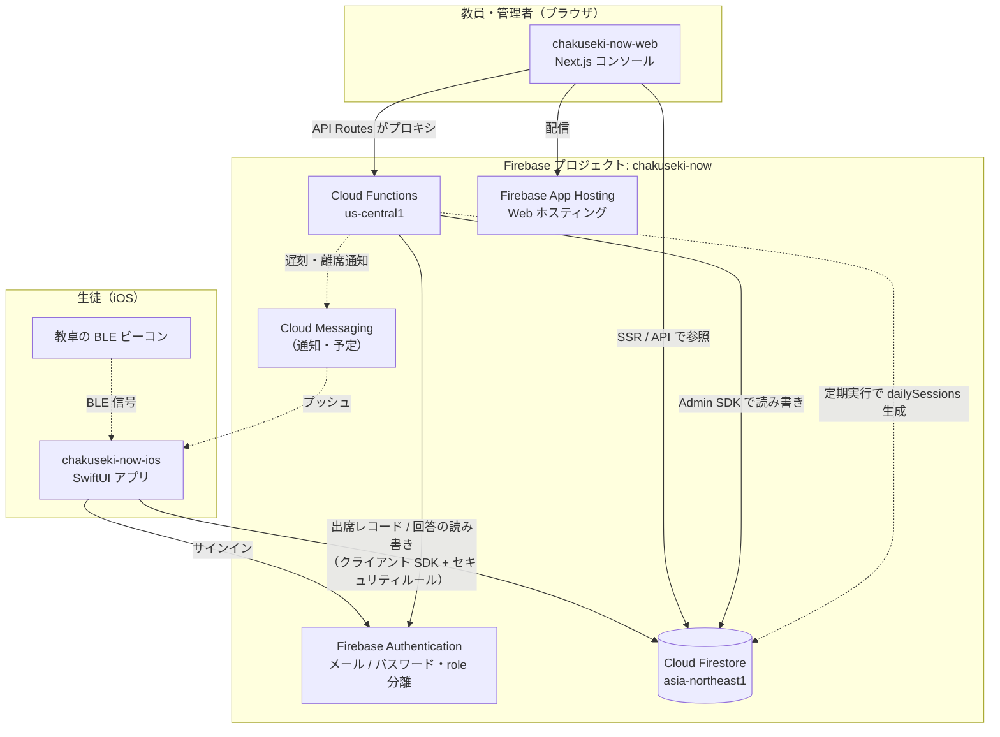

# 着席なう システム構成

「着席なう」は **生徒用 iOS アプリ**と**教員用 Web コンソール**の 2 クライアントが、
共通の Firebase プロジェクト `chakuseki-now` を介して連携するサーバーレス構成です。

## リポジトリ

| リポジトリ | 役割 | 主なスタック |
|---|---|---|
| `chakuseki-now-ios` | 生徒用ネイティブアプリ | SwiftUI / Firebase iOS SDK（Auth・Firestore）/ CoreLocation（BLE） |
| `chakuseki-now-web` | 教員・管理者用 Web コンソール | Next.js 15（Pages Router）/ React 18 / TypeScript / Firebase App Hosting |
| （共通バックエンド） | データ・認証・判定ロジック | Cloud Firestore / Firebase Authentication / Cloud Functions / FCM |

## 全体構成図



## クライアント別の詳細

### 生徒用 iOS アプリ（chakuseki-now-ios）

- **認証**: `AuthService` が Firebase Auth（メール / パスワード）。`users` ドキュメントの `uid` フィールドでアカウントとプロフィールを紐付け。
- **ビーコン検知**: `BeaconManager` が CoreLocation で複数 UUID（全教員の `beaconId`）を同時 ranging。
- **出席チェックイン**: `AttendanceCheckInService` が Firestore クライアント SDK で直接書き込み。
  - 検知 → 当日の該当時限を特定 → `sessions` / `attendanceRecords` 作成
  - 一言コメント送信 → `status` 確定（開始15分超で `late`）＋ `checkinAnswers` 作成
  - 授業終了まで滞在監視（30分圏外で `mid_absence`、終了時圏外で `early_leave`）
- **参照系**: `TimetableRepository` / `AttendanceRepository` が `schedules` + `periods` + `attendanceRecords` を join し、時間割・履歴カレンダーを構築。
- Firestore セキュリティルールで `sessions` / `attendanceRecords` / `checkinAnswers` の書き込みを認証済みユーザーに限定。

### 教員用 Web コンソール（chakuseki-now-web）

- **配信**: Firebase App Hosting（`apphosting.yaml` / `firebase deploy --only apphosting`）。`firebase.json` の Hosting rewrites で `/api/*` を各 Cloud Function にルーティング。
- **画面**（`pages/`）: ダッシュボード（`/`）、出席管理（`/attendance`）、リアルタイム在室（`/monitor`）、時間割（`/schedule`・`/schedule-upload`・`/schedule-detail`）、生徒・クラス / 進級（`/promotion`）、ログイン（`/login`）。
- **API 層**（`pages/api/`）: Next.js API Routes が Cloud Functions への薄いプロキシ（例: `/api/auth/login` → `loginWithEmailPassword`）。SSR / API からの Firestore 参照は `lib/firestoreRest.ts`（Firestore REST + OAuth トークン）。

### Cloud Functions（chakuseki-now-web/functions）

Node 24 / `firebase-admin` / `firebase-functions` v7。`onRequest`（HTTP）と `onSchedule`（定期）。

| 分類 | 関数 |
|---|---|
| 認証 | `loginWithEmailPassword`, `registerUser` |
| 生徒向け | `studentBeacon`, `studentAnswer`, `studentAttendanceCalendar`, `studentAttendanceSummary`, `studentTimetable` |
| 教員向け | `teacherAttendanceRecord`, `teacherQuestion`, `teacherScheduleTeacher`, `teacherAttendanceBook`, `teacherRegisterBeacon` |
| 管理・お題 | `adminGenerateDailySessions`, `createCheckinQuestion` |
| 定期実行 | `generateDailySessions`（`schedules` から当日分の `dailySessions` を自動生成） |

## 共通バックエンド（Firebase: chakuseki-now）

| サービス | 用途 |
|---|---|
| **Cloud Firestore**（`asia-northeast1`） | 単一の信頼できるデータソース。コレクション: `users` / `classes` / `schedules` / `periods` / `dailySessions` / `sessions` / `attendanceRecords` / `attendanceOverrides` / `checkinQuestions` / `checkinAnswers`。詳細は [`er-diagram.md`](./er-diagram.md) |
| **Firebase Authentication** | メール / パスワード。`users.role`（`student` / `teacher`）で権限を分離 |
| **Cloud Functions**（`us-central1`） | 出欠判定・集計・時間割からの授業生成・認証プロキシ |
| **Firebase App Hosting** | 教員用 Web コンソールのホスティング |
| **Cloud Messaging (FCM)** | 遅刻・離席の通知（`users.fcmToken`、実装は今後） |
| **Firestore セキュリティルール** | クライアント（iOS）からの書き込みを制御。`read` の厳格化は Web 側の Auth 対応まで保留 |

## 主要データフロー

### 1. 出席（学内・ビーコン方式）

```
教卓ビーコン ──BLE──▶ iOS が検知
  ▼
iOS: 当日の dailySession を特定（教員 × 自クラス × 時限の時間窓）
  ▼
iOS ──書き込み──▶ Firestore: sessions / attendanceRecords（status=absent）
  ▼
生徒が一言コメント送信 ──▶ Firestore: attendanceRecords.status=present|late + checkinAnswers
  ▼
授業終了まで iOS が滞在監視 ──▶ lastDetectedAt / absenceMinutes 更新、
                                30分圏外で mid_absence、終了時圏外で early_leave
  ▼
教員が Web コンソールで確認・修正 ──▶ attendanceOverrides
```

### 2. お題（一言質問）

```
教員 Web: teacherQuestion / createCheckinQuestion ──▶ Firestore: checkinQuestions
  ▼
iOS がお題を取得 ──▶ 生徒が回答 ──▶ Firestore: checkinAnswers（attendance_reId で出席レコードに紐付け）
  ▼
教員 Web がリアルタイムで回答一覧を表示
```

### 3. 時間割・授業インスタンス

```
教員 Web: schedule-upload ──▶ Firestore: schedules（曜日 × 時限 × クラス）
  ▼
Cloud Functions: generateDailySessions（定期）──▶ 当日分の dailySessions を生成
  ▼
iOS / Web が dailySessions + periods + schedules を join して時間割を表示
```

## デプロイ

| 対象 | コマンド | 配信先 |
|---|---|---|
| iOS アプリ | Xcode Archive → App Store Connect | App Store（`jp.chakuseki-now-ios` /「着席なう」） |
| Web コンソール | `firebase deploy --only apphosting` | Firebase App Hosting |
| Cloud Functions | `firebase deploy --only functions` | Cloud Functions（`us-central1`） |
| Firestore ルール / インデックス | `firebase deploy --only firestore` | プロジェクト `chakuseki-now` |
