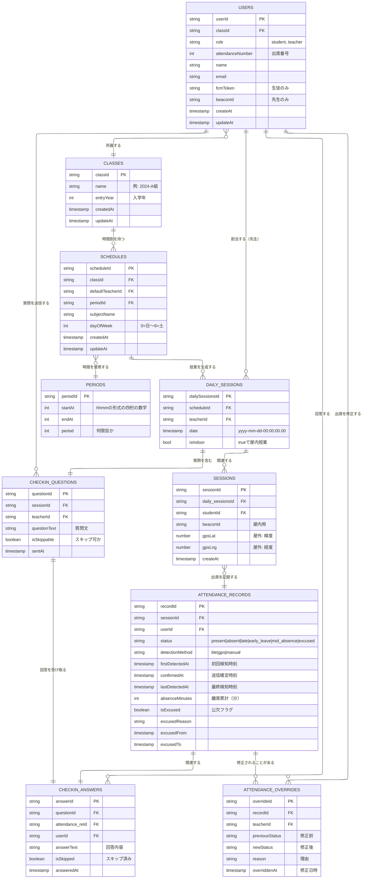

# ER図 — 着席なう データモデル

Firestore のコレクション設計の正本。最終更新: 2026-08-31

> コレクション名は camelCase（`users`, `attendanceRecords` など）。
> 下記エンティティ名（SNAKE_CASE）とフィールド名の対応・現状との差分は
> このファイル末尾の「実装との差分」を参照。

## 前バージョンからの主な変更点

| エンティティ | 変更 |
|---|---|
| USERS | `gradeYear` を削除、`attendanceNumber`（出席番号）を追加。`createAt` / `updateAt` を追加 |
| CLASSES | `gradeYear` → **`entryYear`（入学年）**。`updateAt` を追加 |
| PERIODS | `startAt` / `endAt` が **timestamp → int（hhmm 4桁、例 `915`）** |
| DAILY_SESSIONS | 日付フィールド名 `timestamp` → **`date`** |
| SESSIONS | `scheduleId` を削除。FK は **`daily_sessionsId`** のみ（＋ `studentId`） |
| CHECKIN_ANSWERS | `sessionId` → **`attendance_reId`**（ATTENDANCE_RECORDS.recordId を参照） |
| SCHEDULES | `updateAt` を追加 |
| リレーション | DAILY_SESSIONS–CHECKIN_QUESTIONS、ATTENDANCE_RECORDS–CHECKIN_ANSWERS、CHECKIN_QUESTIONS–CHECKIN_ANSWERS が 1:1 に |

## 実装との差分（2026-08-31 反映済み）

Firestore データ・iOS コードともに上記ER図へ移行済み（移行スクリプト: scratchpad `migrate-er.mjs`）。

- `periods.startAt/endAt` … Timestamp → **Int（hhmm 例 `915`）**。`TimetableRepository.fetchPeriods` も Int 読み＋整形に変更
- `dailySessions` … 日付フィールド `timestamp` → **`date`**。`AttendanceCheckInService` も `date` を参照
- `sessions` … `scheduleId` 削除、`dailySessionsId` → **`daily_sessionsId`**。`AttendanceCheckInService` の書き込み・`TimetableRepository.fetchStatusByDay`（daily_sessionsId 経由で scheduleId 解決）を変更
- `checkinAnswers` … `sessionId` → **`attendance_reId`**（`attendanceRecords.recordId` 参照）。`AttendanceCheckInService` も対応
- `users` … `gradeYear` 削除、**`attendanceNumber`**（生徒: 出席番号）/ `createAt` / `updateAt` 追加。`AuthService.Profile` は `gradeYear` → `attendanceNumber`、マイページは「学年」→「出席番号」表示に変更
- `classes` … `gradeYear` → **`entryYear`（2025）**、`updateAt` 追加
- `schedules` … `updateAt` 追加

### ER 図に無い実装上の追加フィールド

- `users.uid` … Firebase Auth UID。Auth ⇔ users の紐付けに使用（[[firebase-setup]] 参照）
- 出席チェックインのドキュメント ID は決定論的（`{dailySessionId}__{userId}`, `rec_…`, `ans_…`）
